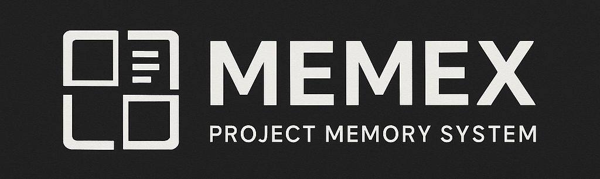

# Memex (Project Memory System)

**An intelligent project-context management system to boost development productivity using AI assistants like Cursor IDE.**

This project provides a suite of tools for creating, managing, and leveraging your project's "memory." This memory consists of:

1.  **Tasks:** Current tasks, their status, execution plan, and notes.
2.  **Code Snippets & Notes:** Important code fragments and arbitrary facts, ideas, or contextual information, managed in a unified way.
3.  **Preferences:** General guidelines for the AI assistant (e.g., coding style, key technologies).
4.  **Code Chunks:** Automatically indexed and chunked code from your project.

All of this information is embedded and stored in a vector database (FAISS), enabling semantic search. The system automatically generates a `memory.mdc` file that Cursor IDE can use to provide more relevant context when generating code or answering queries.

## Key Features

*   **Centralized Task Store:** Manage tasks in a human-readable `TASKS.yaml` format (default: `docs/TASKS.yaml`).
*   **Unified Memory Management:** Context-aware snippets and flexible notes are managed together for streamlined capture and access.
*   **Semantic Search:** Query tasks, snippets, notes, and code chunks based on their semantic relevance to your query.
*   **Cursor IDE Integration:** Auto-generate `memory.mdc` for AI context injection.
*   **Code Indexing:** Automatically scan your codebase, chunk files by logical units (functions, classes, sections), and index them for semantic search.
*   **Configurable:** Customize via `memory.toml` (included files for indexing, prompt parameters, paths, etc.).
*   **Professional CLI Interface:** `memex_cli.py` provides a unified entry point for all operations (task management, memory addition, context generation, etc.).
*   **Memex Hub (Web Dashboard):** User-friendly Gradio UI with a task-centric "Focus" tab, a unified "Memory" tab, and comprehensive management features.
*   **Automatic Bootstrapping:** The `bootstrap_memory.py` script for quick project setup.
*   **Drop-in Module:** Can be installed as a subdirectory in existing projects with minimal configuration.
*   **Free-Text Task Input:** Natural language-like syntax for quickly creating tasks with a single text input via the UI or CLI.
*   **Modular UI Architecture:** Tab-based UI with clean separation of concerns for easier maintenance and extension.
*   **Thread Safety & Memory Management:** Robust backend with thread-safe vector store operations and memory-bounded index caching.

## How It Works

1.  **Memory Storage:** All memory items (tasks, snippets, notes, code chunks) are stored in a FAISS vector store with metadata.
2.  **Semantic Indexing:** Each memory item is converted into an embedding vector using a sentence transformer.
3.  **Task-Driven Context:** When generating `memory.mdc`, the system primarily uses your active tasks (or a specific focus query) to query the vector store and retrieve the most relevant context.
4.  **Dynamic Context Selection:** The system automatically selects the most relevant tasks, snippets, notes, and code chunks based on your current focus.
5.  **Cursor IDE Integration:** The generated `memory.mdc` file is placed in the `.cursor/rules/` directory (path configurable), where Cursor automatically picks it up.

## Project Structure

```
# When memex is a subdirectory of your host project (typical setup):
host-project/
├─ .cursor/                    # Directory for Cursor IDE and vector store (created in host project root by default)
│  ├─ rules/memory.mdc         # Auto-generated context file for Cursor
│  └─ vecstore/                # FAISS storage (index.faiss, metadata.json)
├─ src/                        # Your host project source code
├─ memex/                      # The memex subdirectory
│  ├─ docs/                    # User-editable documents & system documentation
│  │  ├─ TASKS.yaml            # Tasks file (managed via CLI or UI)
│  │  ├─ PREFERENCES.yaml      # Project preferences file
│  │  └─ DATA_FORMATS.md       # Documentation of data structures
│  ├─ scripts/                 # Core backend logic and CLI tools
│  │  ├─ memory_utils.py       # Common utilities (config, FAISS, embeddings)
│  │  ├─ thread_safe_store.py  # Thread-safe wrapper for memory_utils
│  │  ├─ memory_bounded_index_manager.py # Memory management for FAISS cache
│  │  ├─ task_store.py         # Module for interacting with TASKS.yaml
│  │  ├─ tasks.py              # Logic for task management CLI & UI
│  │  ├─ add_memory.py         # Logic for adding arbitrary notes
│  │  ├─ add_snippet.py        # Logic for adding code snippets
│  │  ├─ search_memory.py      # Logic for vector-database search
│  │  ├─ gen_memory_mdc.py     # Logic for generating memory.mdc
│  │  ├─ bootstrap_memory.py   # Logic for initializing the project
│  │  ├─ index_codebase.py     # Logic for scanning and indexing project files
│  │  ├─ code_indexer_utils.py # Utilities for chunking code files
│  │  ├─ init_store.py         # Logic for initializing the vector store
│  │  └─ check_store_health.py # Logic for verifying vector store integrity
│  ├─ ui/                      # UI components for Memex Hub (web dashboard)
│  │  ├─ main_app.py           # Main application for the modular Gradio UI
│  │  ├─ focus_tab.py          # Focus tab UI (task-driven context)
│  │  ├─ memory_tab.py         # Unified Memory (snippets/notes) tab UI
│  │  ├─ tasks_tab.py          # Tasks tab UI
│  │  ├─ search_tab.py         # Search tab UI
│  │  ├─ preferences_tab.py    # Preferences tab UI
│  │  ├─ settings_tab.py       # Settings tab UI
│  │  ├─ dashboard_tab.py      # Dashboard tab UI
│  │  └─ shared_utils.py       # Shared utilities for UI tabs
│  ├─ tests/                   # Test files
│  │  └─ ...
│  ├─ memex_cli.py             # Main CLI entry point
│  ├─ memory.toml              # System configuration file
│  └─ ...
└─ ...                         # Other host project files
```

## Requirements

*   Python 3.9+ (3.11 recommended)
*   Core dependencies listed in `requirements.txt`:
    *   `sentence-transformers` - For embedding text
    *   `faiss-cpu` (or `faiss-gpu` if you have a GPU) - Vector database
    *   `tiktoken` - For token counting
    *   `PyYAML` - For YAML file handling
    *   `tomli` and `tomli-w` - For TOML file handling
    *   `gradio` - For the web dashboard UI
    *   `filelock` - For thread-safe file operations
    *   `psutil` - For memory monitoring
*   Optional agent-related dependencies in `requirements-agents.txt`.
*   Development dependencies in `requirements-dev.txt` (e.g., `pytest`).

## Installation

### Option 1: As a Standalone Project (Less Common)

1.  **Clone the repository:**
    ```bash
    git clone https://github.com/vovarbv/memex.git
    cd memex
    ```

2.  **Create and activate a virtual environment (recommended):**
    ```bash
    python -m venv .venv
    source .venv/bin/activate  # Linux/macOS
    # .venv\Scripts\activate   # Windows
    ```

3.  **Install dependencies:**
    ```bash
    pip install -r requirements.txt
    # For development: pip install -r requirements-dev.txt
    # For agent features: pip install -r requirements-agents.txt
    # Or, if using setup.py:
    # pip install -e .           # Core only
    # pip install -e ".[agents]"   # With agent features
    ```

4.  **Bootstrap the project:** This script scans your project, creates/updates `memory.toml`, and generates empty `docs/TASKS.yaml` and `docs/PREFERENCES.yaml` if missing.
    ```bash
    python memex_cli.py bootstrap_memory
    ```
    _Review the generated `memory.toml`. For standalone, ensure `system.cursor_output_dir_relative_to_memex_root = "."` or similar, and `files.include` patterns point to your code directly (e.g., `src/**/*.py`)._

5.  **Initialize the vector store:** Creates FAISS files (default: `./.cursor/vecstore/`).
    ```bash
    python memex_cli.py init_store
    ```

6.  **Index the codebase:** Scans files based on `memory.toml` and adds them to the FAISS store.
    ```bash
    python memex_cli.py index_codebase
    ```

### Option 2: As a Subdirectory in an Existing Project (Recommended)

1.  **Add Memex to your host project:**
    ```bash
    # From your host project root
    git clone https://github.com/vovarbv/memex.git memex
    # OR copy the memex folder into your project
    ```

2.  **Install dependencies into your host project's environment:**
    ```bash
    pip install -r memex/requirements.txt
    ```

3.  **Run bootstrap from the host project root:**
    ```bash
    # From your host project root
    python memex/memex_cli.py bootstrap_memory
    ```
    This will:
    - Scan your *host project files* (excluding the `memex` subdirectory itself).
    - Create/update `memex/memory.toml`.
        - `files.include` patterns will be relative to the `memex` directory to point to host project files (e.g., `../src/**/*.py`).
        - `system.cursor_output_dir_relative_to_memex_root` will be set to `".."` to place `.cursor` in the host project root.
    - Generate empty `memex/docs/TASKS.yaml` and `memex/docs/PREFERENCES.yaml` if missing.
    _Review `memex/memory.toml` and adjust paths/patterns as needed._

4.  **Initialize the vector store:**
    ```bash
    # From your host project root
    python memex/memex_cli.py init_store
    ```
    This creates FAISS files in your host project's `.cursor/vecstore/` directory.

5.  **Index your codebase:**
    ```bash
    # From your host project root
    python memex/memex_cli.py index_codebase
    ```
    This scans and indexes your host project files according to patterns in `memex/memory.toml`.

## Usage

### Running Memex Commands

The primary way to interact with Memex is via `memex_cli.py`.

**From the `memex` directory:**
```bash
python memex_cli.py <command> [options]
# Example: python memex_cli.py ui
# Example: python memex_cli.py tasks add "New task"
```

**From the host project root (if Memex is a subdirectory):**
```bash
python memex/memex_cli.py <command> [options]
# Example: python memex/memex_cli.py ui
# Example: python memex/memex_cli.py index_codebase
```

**Launcher Scripts (Convenience Wrappers):**
Platform-specific launchers (`memex.sh`, `memex.bat`) and a Python-based launcher (`memex.py`) are provided in the `memex` directory. These simply delegate to `python memex_cli.py`.
```bash
# From memex directory (Unix/macOS)
./memex.sh ui

# From memex directory (Windows)
.\memex.bat ui
```

**Installed Console Scripts (after `pip install -e .`):**
```bash
memex <command> [options]
# Example: memex ui
# Example: memex tasks add "New task"
# Example: memex index --reindex
# Example: memex generate
# Example: memex search "query"
# Example: memex snippet "code"
# Example: memex note "reminder"
```

### 1. Memex Hub - Web Dashboard
The recommended way for most daily operations.
```bash
python memex_cli.py ui
```
Open your browser to the URL shown (typically `http://127.0.0.1:7860` or `http://0.0.0.0:7860`).

**Key Dashboard Tabs:**
*   **🎯 Focus**: Task-centric command center. Select an active task to preview its context and generate `memory.mdc`.
*   **💾 Memory**: Unified interface for managing code snippets and notes. Features quick capture with auto-type detection.
*   **📋 Tasks**: View, add, edit, and delete tasks. Supports free-text input for rapid task creation.
*   **🔍 Search & Filters**: Perform semantic search across all memory items with advanced filtering options.
*   **🎨 Preferences**: Edit `PREFERENCES.yaml` directly.
*   **⚙️ Settings**: Configure `memory.toml`, manage vector store (health check, re-index), and generate `memory.mdc`.
*   **📊 Dashboard**: Overview of system metrics and health.

**Free-Text Task Input:**
A powerful feature in the Tasks tab (and CLI) for creating tasks using natural language.
Example:
```
Implement login form validation
plan: Create validation rules; Write validation functions; Add error messages
status: in_progress priority: high tags: #frontend #auth
notes: Use client-side validation first.
```
See `docs/TASK_PARSER.md` for full syntax.

### 2. Task Management (`tasks`)
CLI for task operations.
```bash
# Add a new task
python memex_cli.py tasks add "Build login page" --plan "HTML form;API endpoint;Tests" --status in_progress

# List tasks
python memex_cli.py tasks list
python memex_cli.py tasks list --status in_progress --details

# Start a task
python memex_cli.py tasks start <task_id>

# Mark a task as done
python memex_cli.py tasks done <task_id>

# Delete a task
python memex_cli.py tasks delete <task_id>

# Add a note to a task
python memex_cli.py tasks note <task_id> "Needs design review."
```
Tasks are stored in `docs/TASKS.yaml` (by default) and synced to the vector DB. See `docs/DATA_FORMATS.md` for task structure.

### 3. Adding Memory Items

*   **Add a note/fact (`add_memory`):**
    ```bash
    python memex_cli.py add_memory "The key auth API is at /auth/v1" --type fact --id db_version_note
    ```

*   **Add a code snippet (`add_snippet`):**
    *   From a string:
        ```bash
        python memex_cli.py add_snippet "def hello(): print('world')" --lang py
        ```
    *   From a file (or part of it, path relative to CWD):
        ```bash
        # If CWD is host-project/
        python memex/memex_cli.py add_snippet --from src/utils/helpers.py:10-25
        python memex/memex_cli.py add_snippet --from src/config.py # Entire file
        ```

### 4. Searching Memory (`search_memory`)
Performs semantic search across all vector-stored items.
```bash
python memex_cli.py search_memory "user authentication implementation"
python memex_cli.py search_memory "database config" -k 3 --type note
```

### 5. Generating Cursor Context (`gen_memory_mdc`)
Gathers data from preferences, active tasks, and relevant memory items, then writes `.cursor/rules/memory.mdc`.
```bash
python memex_cli.py gen_memory_mdc
```
**Context Generation Methods:**
1.  **Task-Driven Context (Default):** Derives context from active tasks.
2.  **Focus-Based Context:**
    ```bash
    python memex_cli.py gen_memory_mdc --focus "user authentication flow"
    ```
**Tip:** Configure a Git pre-commit hook to run this automatically.

### 6. Codebase Indexing (`index_codebase`)
Scans project files (per `memory.toml`), chunks them, and adds to FAISS.
```bash
# Index based on current memory.toml
python memex_cli.py index_codebase

# Re-index (deletes existing code chunks first)
python memex_cli.py index_codebase --reindex

# Show detailed progress
python memex_cli.py index_codebase --verbose
```

### 7. Vector Store Management
*   **Initialize (`init_store`):** Creates FAISS files if they don't exist.
    ```bash
    python memex_cli.py init_store
    ```
*   **Health Check (`check_store_health`):** Verifies FAISS and metadata integrity.
    ```bash
    python memex_cli.py check_store_health --verbose
    ```

### 8. Configuration (`memory.toml`)
Controls system behavior. Key sections:
*   `[files]`: `include` and `exclude` glob patterns for indexing.
*   `[prompt]`: `max_tokens` for `memory.mdc`, `top_k_tasks`, `top_k_context_items`.
*   `[system]`: Paths for `cursor_output_dir_relative_to_memex_root`, `tasks_file_relative_to_memex_root`, `preferences_file_relative_to_memex_root`. These are crucial for correct operation, especially in subdirectory setups.

## Working with Cursor IDE

Once `.cursor/rules/memory.mdc` is generated, Cursor IDE automatically uses its content to provide more accurate, project-specific AI assistance.

## Quick Start (Subdirectory Setup Example)

Assuming Memex is cloned into `your-project/memex/`:

1.  **From `your-project/` (host project root):**
    ```bash
    # Install dependencies
    pip install -r memex/requirements.txt

    # One-time project setup
    python memex/memex_cli.py bootstrap_memory # Creates memex/memory.toml, etc.
                                            # Review memex/memory.toml paths.
    python memex/memex_cli.py init_store     # Creates .cursor/vecstore/ in your-project/
    ```

2.  **Launch the Memex Hub:**
    ```bash
    # From your-project/
    python memex/memex_cli.py ui
    ```
    Open `http://127.0.0.1:7860` in your browser.

3.  **Add your first task (via UI or CLI):**
    ```bash
    # From your-project/
    python memex/memex_cli.py tasks add "Initial project setup" --plan "Configure Memex;Index codebase"
    ```

4.  **Index your codebase:**
    ```bash
    # From your-project/
    python memex/memex_cli.py index_codebase
    ```
    Or use the Settings tab in the Memex Hub.

5.  **Generate Cursor context file:**
    ```bash
    # From your-project/
    python memex/memex_cli.py gen_memory_mdc
    ```
    Or use the Focus or Dashboard tab in the Memex Hub.

6.  Open `your-project/` in Cursor IDE. `memory.mdc` will be used.

## Troubleshooting

### Common Issues
*   **"ModuleNotFoundError" or "ImportError"**:
    *   Ensure your Python environment is activated.
    *   Run `memex_cli.py` from the correct directory (e.g., `memex/` or `your-project/memex/memex_cli.py`).
    *   Consider `pip install -e .` from the `memex` directory if you prefer system-wide commands.
*   **Memory Tab in UI shows no items**:
    *   This might be due to an old metadata format. Run:
        ```bash
        python memex/memex_cli.py check_store_health
        ```
    *   If "CRITICAL MISMATCH" errors are reported, run the migration script (backup first!):
        ```bash
        python memex/scripts/migrate_faiss_keyed_metadata.py
        ```
*   **Vector store corruption**:
    *   Run health check: `python memex/memex_cli.py check_store_health`
    *   If issues persist, you might need to reinitialize the store (this deletes existing vectors): `python memex/memex_cli.py init_store` (be cautious, consider backing up `.cursor/vecstore` first if it contains valuable data that cannot be re-indexed).
    *   Then re-index your codebase: `python memex/memex_cli.py index_codebase --reindex`

### Getting Help
1.  Check the `docs/` directory.
2.  Run CLI commands with `--help` (e.g., `python memex_cli.py tasks --help`).
3.  Review project issues on GitHub.

## Roadmap (Future Vision)

*   **Deeper IDE Integration**: Cursor task panel, auto-snippet addition from IDE.
*   **Smarter Context**: Enhanced learning, temporal relevance, feedback loops.
*   **Advanced Automation**: Auto-task generation from Git/code analysis.

## Development

### Testing

The project includes a comprehensive test suite with 190 tests covering all major functionality:

```bash
# Run all tests
python -m pytest tests/

# Run tests with coverage
python -m pytest tests/ --cov=scripts --cov=ui

# Run specific test file
python -m pytest tests/test_tasks_cli.py -v
```

**Current Status**: 
- ✅ 158 tests passing (100% of active tests)
- ⏭️ 31 tests skipped (legacy/UI tests)
- ⚠️ 1 test xfailed on Windows (OS limitation)

### Code Quality

The codebase follows professional development standards:
- Thread-safe vector store operations
- Memory-bounded index caching
- Proper error handling and recovery
- Comprehensive test coverage
- Type hints and documentation

## Contributing

Suggestions, bug reports, and pull requests are welcome!

## License

MIT License (see LICENSE file).
Copyright (c) 2025 vovarbv