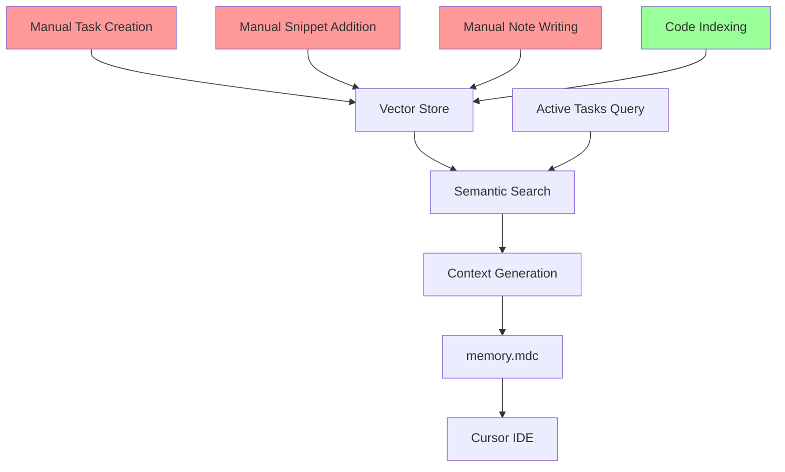
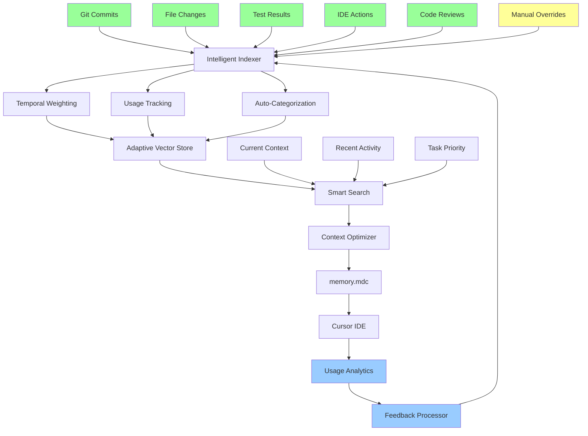

# Data Flow: Current vs. Proposed

## Current Data Flow



**Legend:**
- 🔴 Red: Manual effort required
- 🟢 Green: Automatic process

## Proposed Enhanced Data Flow



**Legend:**
- 🟢 Green: Automatic collection
- 🟡 Yellow: Optional manual input
- 🔵 Blue: Feedback loop

## Key Differences

### Input Sources

| Current | Proposed |
|---------|----------|
| Manual task creation | Auto-extract from git commits |
| Manual snippet addition | Auto-extract from hot code paths |
| Manual note writing | Auto-extract from comments/docs |
| Basic code indexing | Smart indexing with usage tracking |

### Processing

| Current | Proposed |
|---------|----------|
| Static relevance | Temporal decay weighting |
| No usage tracking | Track what gets included |
| Simple semantic search | Multi-factor scoring |
| No learning | Feedback-based optimization |

### Context Generation

| Current | Proposed |
|---------|----------|
| Task-driven only | Multi-signal context |
| Static preferences | Adaptive preferences |
| Token limit only | Diversity + relevance optimization |
| One-way flow | Closed feedback loop |

## Data Flow Efficiency

### Current System
```
User Effort: ████████░░ 80%
Automation:  ██░░░░░░░░ 20%
```

### Proposed System
```
User Effort: ██░░░░░░░░ 20%
Automation:  ████████░░ 80%
```

## Implementation Phases

### Phase 1: Quick Wins (2-4 weeks)
```
Git Integration ──┐
                  ├──> Basic Automation (40% reduction in manual work)
Usage Tracking ───┘
```

### Phase 2: Smart Collection (1-2 months)
```
File Watchers ────┐
Test Integration ─┼──> Advanced Automation (70% reduction)
IDE Observers ────┘
```

### Phase 3: Adaptive Intelligence (2-3 months)
```
Feedback Loop ────┐
ML Scoring ───────┼──> Self-Optimizing System (90% reduction)
Auto-Learning ────┘
```

## Expected Outcomes

### Time Savings
- **Current**: 30-60 minutes/week on maintenance
- **Phase 1**: 15-20 minutes/week
- **Phase 2**: 5-10 minutes/week
- **Phase 3**: < 5 minutes/week

### Context Quality
- **Current**: 60% relevant content
- **Phase 1**: 75% relevant content
- **Phase 2**: 85% relevant content
- **Phase 3**: 90%+ relevant content

### Developer Satisfaction
- **Current**: "Useful but high maintenance"
- **Proposed**: "It just works"